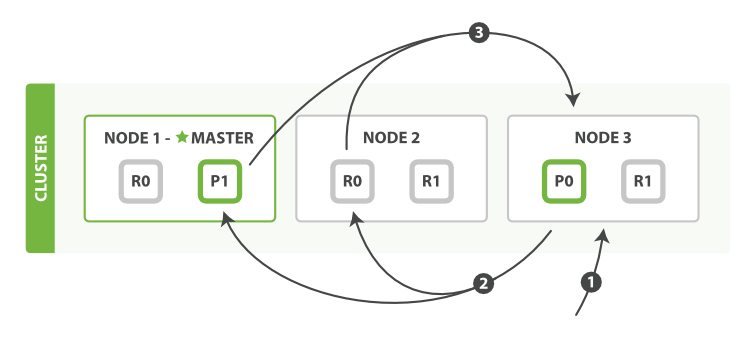
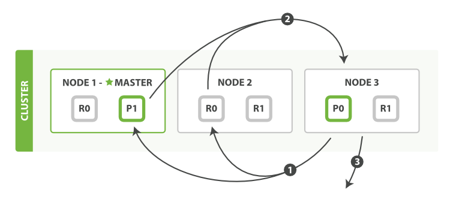

#### 内容来自：Elasticsearch 权威指南

##### 1.elasticsearch如何执行分布式搜索

query then fetch

query 阶段：

1.客户端发送 search 请求到 Node 3 , Node 3 充当 coordinating Node , 会创建一个大小为 from + size 的空优先队列

2.Node 3 将请求转发到索引的每个主分片 primary shard 或者副本分片 replica shard 中。每个分片在本地执行查询并添加结果到大小为 from + size 的本地有序优先队列中

3.每个分片返回各自优先队列中所有文档的 id 和排序值给协调节点 coordinating Node , 也就是 Node 3 , 它合并这些值到自己的优先队列中来产生一个全局排序后的结果列表

fetch 阶段：

1.协调节点辨别出哪些文档需要取回并向相关分片提交多个get请求

2.每个分片加载并丰富文档，如果有需要的话接着返回文档给协调节点

3.所有文档都被取回，协调节点返回结果给客户端

协调节点决定取回：例如指定  `{ "from": 90, "size": 10 }` ，最初的90个结果会被丢弃，只有从第91个开始的10个结果需要被取回

协调节点给持有相关文档的每个分片创建一个 [multi-get request](https://www.elastic.co/guide/cn/elasticsearch/guide/current/distrib-multi-doc.html) ，并发送请求给同样处理查询阶段的分片副本。

##### 2.elasticsearch分布式搜索中深分页问题

先查后取，每个分片创建from + size长度的队列，协调节点需要根据 number_of_shards * (from + size) 排序文档，来找到包含在 size 里的文档。当 from 值足够大，排序过程会非常沉重，“深分页” 很少符合人的行为。当2到3页过去以后，人会停止翻页

##### 3.偏好preference参数作用

